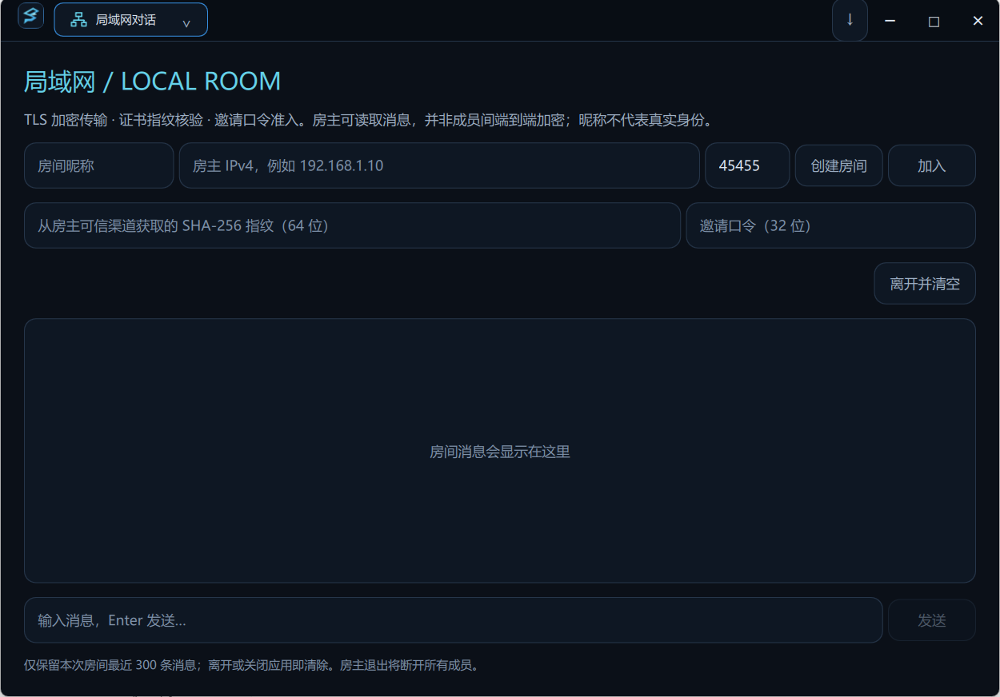

<p align="center">
  
</p>

<h1 align="center">SakuraChat</h1>

<p align="center">
  <strong>现代化 · 强加密 · 端到端私密与局域网即时通讯客户端</strong><br>
  <strong>Modern, Secure & Private Desktop Instant Messaging Client</strong><br>
  <strong>モダンで安全、E2EEプライベート＆暗号化LAN通信に対応したデスクトップIMクライアント</strong>
</p>

<p align="center">
  <a href="#-简体中文">简体中文</a> •
  <a href="#-english">English</a> •
  <a href="#-日本語">日本語</a>
</p>

<p align="center">
  
  
  
  
  
  
  
</p>

---

## 📸 界面预览 / Visual Showcase / スクリーンショット

> [!NOTE]
> 截图文件存放在 `docs/images/` 目录下。更多详细截图指引见文末说明。
> Screenshots are located in `docs/images/`. Detailed capture instructions can be found below.

| 主聊天界面 (Main Chat) | Signal 端到端隐私对话 (Private Chat) |
| :---: | :---: |
|  |  |
| *Kali 终端暗黑美学 · 会话与消息流* | *双棘轮端到端加密 · 安全码防中间人核验* |

| 局域网加密房间 (LAN Chat) | 联系人与好友申请 (Contacts & Requests) |
| :---: | :---: |
|  |  |
| *零服务器内网自组网 · 内存临时存储* | *防抖智能搜索 · 好友关系与状态管理* |

| 应用锁与防窥探遮罩 (App Lock) | 隐私与消息自动清理设置 (Privacy Settings) |
| :---: | :---: |
|  |  |
| *独立 PIN 码保护 · 毛玻璃防窥探遮罩* | *消息到期自动销毁 · 本地缓存安全清理* |

---

## 🇨🇳 简体中文

### 💡 核心特性

1. **🛡️ Signal 协议端到端隐私对话（Private Chat）**
   - 集成官方固定版本 `libsignal` Rust 原生库（C-ABI 桥接），实现行业公认的 **Double Ratchet（双棘轮算法）** 与 **Prekey Bundle（预密钥机制）**。
   - **零知识盲中继**：服务端仅转发不可破译的加密封包（GateServer `/private/v1`），完全无法解密正文或提取会话私钥。
   - **安全码防冒充核验（Safety Numbers）**：支持双方比对 60 位数字指纹，彻底防御中间人攻击（MITM）。
   - **本地密钥强隔离**：私钥与加密会话库经 Windows DPAPI 硬件绑定加密存储，有效抵御本地冷拷贝与横向渗透。

2. **⚡ 零服务器局域网加密房间（LAN Chat）**
   - **摆脱中心依赖**：无需登录云端账号、无需外部公网，局域网内随开随用。
   - **动态 TLS 安全传输**：基于 TLS 1.2+ 协议与运行时动态生成的 EC P-256 临时证书，辅以 SHA-256 指纹核验与加密口令准入。
   - **不留痕迹**：消息全程只存在于内存，退出客户端或关闭房间立即焚毁，绝不落盘。

3. **☁️ 高可用云端即时通讯（Cloud IM）**
   - 搭配分布式微服务后端架构（ChatServer 多实例动态路由、Redis 状态缓存）。
   - **强一致时序保证**：基于 Sequence 序号保证消息全局有序、离线与掉线断点续传。
   - **已读回执与送达确认**：支持精确的消息状态反馈（发送中、已送达、已读）。
   - **消息撤回与生命周期管理**：支持单向本地删除与双向撤回广播；支持配置基于时间阈值的到期自动销毁策略。

4. **🎨 Kali 极客暗黑风交互体验（Cyber-Dark UI）**
   - 深度融合石墨黑（Graphite Black）与冷蓝（Ice Blue）霓虹风格，科技感十足。
   - 基于 **Qt 6.8 + QML** 声明式引擎开发，拥有丝滑的高刷渲染、自适应消息气泡排版与右键上下文交互。

5. **🔒 纵深防御与本地安全屏障**
   - **本地缓存防窃密**：明文临时数据经 Windows DPAPI 动态加解密，内存中敏感凭据用后即刻零填充擦除。
   - **独立应用锁（App Lock）**：闲置自动锁定、全屏毛玻璃模糊遮罩保护、错误 PIN 码安全冷却抑制暴力破解。
   - **通知隐私脱敏**：弹窗可配置隐藏发送者昵称与消息摘要，公共场合避免尴尬。

6. **📦 双轨分发与轻量升级提示**
   - **正式分发版（Distribution）**：强制开启 `SAKURA_DISTRIBUTION`，数字证书签名验证，纯 HTTPS/TLS 通道。
   - **免安装便携版**：内置公有 CA、严格验证 HTTPS/TLS。ZIP 未进行 Windows 代码签名，账号数据保存在当前 Windows 用户目录。
   - **轻量检测**：内嵌 GitHub Releases API 版本探针，有新版时轻量红点提示，杜绝流氓静默安装。

---

### 🛠️ 技术栈

| 领域 | 核心技术 / 库 |
| :--- | :--- |
| **界面与图形** | Qt 6.8.3 LTS, QML (QtQuick Controls), 高 DPI 自适应 |
| **编程语言** | C++17 (客户端核心), Rust (Signal 加密桥接) |
| **端到端加密** | `libsignal` (Rust FFI / C-ABI), Double Ratchet, Curve25519 / Kyber |
| **传输与安全** | OpenSSL 3.x, TLS 1.2 / 1.3, Windows CryptoAPI / DPAPI (`CryptProtectData`) |
| **本地数据** | SQLite 3 (WAL 模式, 经 DPAPI 加密防护) |
| **通讯网络** | HTTP/HTTPS (RESTful API), TCP Socket (自定义二进制封包), JSON |
| **构建系统** | CMake 3.20+, MinGW-w64 64-bit / MSVC |

---

### 🚀 快速上手与本地构建

#### 1. 前置依赖
- **操作系统**：Windows 10 / 11 (64-bit)
- **C++ 编译器与框架**：Qt 6.8.3 (MinGW 64-bit 或 MSVC 2022 x64)
- **构建工具**：CMake >= 3.20, Ninja / MinGW Makefiles
- **Rust 工具链**（仅构建 Signal 桥接时需要）：Rust 1.75+ (MSVC 工具链)
- **密码学库**：OpenSSL 3.x

#### 2. 编译 Signal Rust 桥接库
```powershell
# 运行自动化编译脚本生成 signal_bridge 动态库与引入头文件
cd SakuraChat
powershell tools/build-private-chat.ps1
```

#### 3. 编译客户端
使用 **Qt Creator** 打开 `SakuraChat/CMakeLists.txt`，选择 `Qt 6.8.3 MinGW 64-bit` Kit 即可直接构建与运行。

或通过命令行构建：
```powershell
mkdir build && cd build
cmake -G "Ninja" -DCMAKE_BUILD_TYPE=Release ..
cmake --build . --config Release
```

#### 4. 打包分发
- **生成未签名便携包**（完整参数见发布文档）：
  ```powershell
  pwsh tools/package-portable.ps1
  ```
- **制作正式签名安装程序**：
  ```powershell
  powershell tools/build-release.ps1
  ```

---

### 📚 相关文档

- 🔐 [Signal 隐私对话模块设计](docs/PRIVATE_CHAT.md)
- 🌐 [局域网加密对话机制与安全边界](docs/LAN_CHAT.md)
- 💬 [云端聊天记录与已读回执](docs/CHAT_HISTORY_READ_RECEIPTS.md)
- 🛡️ [安全与隐私整体设计](docs/SECURITY_PRIVACY.md) · [应用锁实现](docs/APP_LOCK.md)
- 🗄️ [本地缓存保护机制](docs/LOCAL_CACHE_PROTECTION.md) · [消息清理策略](docs/MESSAGE_DELETION.md)
- 🚀 [发布、便携打包与签名规范](docs/RELEASE.md)
- 🎨 [Kali 暗黑界面设计与交互重构](docs/UI_REFRESH.md)

---

## 🇺🇸 English

### 💡 Highlights & Key Features

1. **🛡️ Signal Protocol E2EE Private Chat**
   - Built on official, pinned-version `libsignal` Rust core via high-performance C-ABI bindings.
   - **Zero-Knowledge Blind Relay**: The server (`GateServer /private/v1`) acts exclusively as an untrusted ciphertext forwarder, completely unable to decrypt messages or compromise session keys.
   - **Double Ratchet & Prekey Bundles**: Perfect Forward Secrecy (PFS) and break-in recovery guaranteed for every message.
   - **Safety Numbers Verification**: 60-digit numeric fingerprint comparison protects against Man-In-The-Middle (MITM) attacks.
   - **DPAPI Key Sealing**: Cryptographic identity keys and message records are sealed with hardware-bound Windows DPAPI.

2. **⚡ Zero-Server TLS Encrypted LAN Chat**
   - **Zero Infrastructure Required**: Peer-to-peer/mesh LAN chat rooms that operate without cloud login or internet connectivity.
   - **Ephemeral TLS 1.2+ Security**: Ephemeral EC P-256 self-signed certificates dynamically generated per session with SHA-256 fingerprint verification.
   - **Zero Disk Residue**: Messages reside exclusively in volatile memory; closing the room burns all chat trails permanently.

3. **☁️ Full-Featured Cloud Instant Messaging**
   - Microservices backend with dynamic multi-instance routing and Redis state synchronization.
   - **Sequence-Ordered Sync**: Continuous message sequencing guarantees gapless, chronological message recovery.
   - **Delivery & Read Receipts**: Real-time status indicators (sending, delivered, read).
   - **Message Retention & Deletion**: Local deletion, dual-sided revocation broadcasts, and configurable TTL-based automatic destruction.

4. **🎨 Cyber-Dark Terminal Aesthetic (Kali Style)**
   - Custom-crafted graphite black and ice-blue neon UI tailored for developers and security enthusiasts.
   - Powered by **Qt 6.8 + QML** with fluid animations, adaptive message bubble layouts, and contextual quick actions.

5. **🔒 Defense-in-Depth Local Privacy**
   - **Memory Hygiene**: Ephemeral sensitive keys and credentials are systematically wiped from RAM upon disposal.
   - **PIN-Protected App Lock**: Idle screen blur overlay with exponential cooldown against PIN brute-force attempts.
   - **Notification Masking**: Sender identity and preview texts can be masked to safeguard privacy in public spaces.

6. **📦 Dual-Track Release Pipeline**
   - **Official Distribution**: Built with `-DSAKURA_DISTRIBUTION=ON`, Inno Setup packaging, and Windows SDK digital code signing.
   - **Portable Package**: Production TLS policy and bundled public CA, distributed as an unsigned ZIP. Local account data remains in the Windows user profile.
   - **GitHub Releases Watcher**: Lightweight unobtrusive indicator on new release discovery.

---

### 🛠️ Technology Stack

| Domain | Technology / Library |
| :--- | :--- |
| **GUI Framework** | Qt 6.8.3 LTS, QML (QtQuick Controls), High-DPI Scaling |
| **Core Language** | C++17 (Client Logic), Rust (Signal Bridge) |
| **E2EE Cryptography** | `libsignal` (Rust FFI / C-ABI), Double Ratchet, Curve25519 / Kyber |
| **Transport & Security** | OpenSSL 3.x, TLS 1.2 / 1.3, Windows DPAPI (`CryptProtectData`) |
| **Local Storage** | SQLite 3 (WAL Mode, DPAPI Column & File Protection) |
| **Protocols** | HTTP/HTTPS (RESTful API), Binary TCP Stream Protocol, JSON |
| **Build Tools** | CMake 3.20+, MinGW-w64 64-bit / MSVC |

---

### 🚀 Getting Started & Building

#### Prerequisites
- Windows 10 / 11 (64-bit)
- Qt 6.8.3 (MinGW 64-bit or MSVC 2022 x64)
- CMake >= 3.20 & Ninja
- Rust 1.75+ (Required for compiling the Signal FFI bridge)
- OpenSSL 3.x

#### Step 1: Build Signal Rust Bridge
```powershell
cd SakuraChat
powershell tools/build-private-chat.ps1
```

#### Step 2: Configure & Build Client
Open `SakuraChat/CMakeLists.txt` in **Qt Creator** with the `Qt 6.8.3 MinGW 64-bit` Kit, or run:
```powershell
mkdir build && cd build
cmake -G "Ninja" -DCMAKE_BUILD_TYPE=Release ..
cmake --build . --config Release
```

#### Step 3: Packaging
- Build unsigned portable ZIP: `pwsh tools/package-portable.ps1` (see release documentation for parameters).
- Build signed installer: `powershell tools/build-release.ps1`

---

## 🇯🇵 日本語

### 💡 主な特長

1. **🛡️ Signal プロトコル採用のE2EEプライベートチャット（Private Chat）**
   - 公式のピン留めバージョン `libsignal`（Rust 製）を C-ABI 経由で直接組み込み、業界標準の **Double Ratchet（二重ラチェットアルゴリズム）** と **Prekey Bundle（事前共有鍵）** を完全実装。
   - **ゼロ知識ブラインドリレー**：サーバー（GateServer `/private/v1`）は暗号化パケットの転送のみを行い、会話内容の復号やセッション鍵の取得は構造上不可能です。
   - **安全番号（Safety Numbers）検証**：60桁の識別コードを相互確認し、中間者攻撃（MITM）を徹底的に防止。
   - **Windows DPAPI による鍵封入**：秘密鍵および暗号化セッションはハードウェア紐付けの Windows DPAPI で防護され、ローカルデータの抽出を防ぎます。

2. **⚡ サーバー不要の暗号化LANチャット（LAN Chat）**
   - **中央サーバー完全不要**：クラウドログインや外部インターネット接続なしで、同一LAN内のメンバーと即座に通信可能。
   - **動的 TLS 1.2+ 接続**：セッションごとに動的生成される EC P-256 臨時証明書と SHA-256 フィンガープリント認証、招待パスコードによる厳格な入室管理。
   - **ゼロ痕跡設計**：メッセージはメモリ上のみに存在し、部屋を閉じた瞬間に完全に破棄されます（ディスク書き込みなし）。

3. **☁️ 高機能クラウドインスタントメッセージング（Cloud IM）**
   - 分散マイクロサービス（複数 ChatServer インスタンス動的ルーティング、Redis 状態キャッシュ）に対応。
   - **確実な時系列同期**：Sequence 連番により、オフライン復帰時もメッセージ順序を厳格に保持。
   - **送信・既読レシート**：メッセージの到達状態（送信中・配信完了・既読）をリアルタイムに視覚化。
   - **メッセージ取り消しとライフサイクル管理**：双方向取り消し放送、ローカル削除、および指定時間経過後の自動削除に対応。

4. **🎨 Kali スタイルのサイバーダーク UI（Cyber-Dark UI）**
   - グラファイトブラックとアイスブルーのネオンカラーを基調とした、サイバー感溢れるダークテーマ。
   - **Qt 6.8 + QML** による滑らかなレンダリング、レスポンシブな吹き出しレイアウト、直感的なコンテキストメニュー。

5. **🔒 多層防御とローカルセキュリティ**
   - **メモリ保護とゼロ化**：不要になった認証情報や秘密鍵はメモリ上で即座にゼロクリア。
   - **独立 PIN アプリロック**：一定時間無操作時の自動ロック、すりガラス調ブラー画面による覗き見防止、PIN 入力ミスの安全クールダウン。
   - **プライベート通知**：公共の場での覗き見を防ぐため、トースト通知での送信者や本文のマスキングが可能。

6. **📦 デュアルトラック配布と軽量アップデート通知**
   - **公式署名版（Distribution）**：Inno Setup 製インストーラー、コード署名、強制 HTTPS/TLS 通信。
   - **ポータブルテスト版（Insecure Test）**：独立データディレクトリに隔離された免インストール ZIP パッケージ。
   - **GitHub Releases 連携**：新バージョン検出時は控えめなバッジ通知を表示し、バックグラウンドの勝手なダウンロードは行いません。

---

### 🛠️ 技術スタック

| 分野 | 主要テクノロジー / ライブラリ |
| :--- | :--- |
| **GUI フレームワーク** | Qt 6.8.3 LTS, QML (QtQuick Controls), 高DPI対応 |
| **開発言語** | C++17 (クライアント本体), Rust (Signal ブリッジ) |
| **E2EE 暗号化** | `libsignal` (Rust FFI / C-ABI), Double Ratchet, Curve25519 / Kyber |
| **セキュリティ・通信** | OpenSSL 3.x, TLS 1.2 / 1.3, Windows DPAPI (`CryptProtectData`) |
| **ローカルストレージ** | SQLite 3 (WAL モード, DPAPI 連携暗号化) |
| **プロトコル** | HTTP/HTTPS (RESTful), バイナリ TCP 通信, JSON |
| **ビルドシステム** | CMake 3.20+, MinGW-w64 64-bit / MSVC |

---

### 🚀 クイックスタート

#### 必要環境
- Windows 10 / 11 (64-bit)
- Qt 6.8.3 (MinGW 64-bit または MSVC 2022 x64)
- CMake 3.20 以上 & Ninja
- Rust 1.75+ (Signal ブリッジのビルド用)
- OpenSSL 3.x

#### ビルド手順
```powershell
# 1. リポジトリの取得
git clone https://github.com/your-org/SakuraChat.git
cd SakuraChat

# 2. Signal 暗号化ブリッジのビルド
powershell tools/build-private-chat.ps1

# 3. クライアントのビルド (Qt Creator で CMakeLists.txt を開くか以下を実行)
mkdir build; cd build
cmake -G "Ninja" -DCMAKE_BUILD_TYPE=Release ..
cmake --build . --config Release
```

---

## 📄 开源许可证 / License / ライセンス

本项目遵循开源许可证与各上游组件开源许可：
- 客户端核心代码基于开源协议分发。
- 内置及引用的第三方库（如 `libsignal`、`Qt`、`OpenSSL`）严格遵循其各自的原生许可规范（GPLv3 / LGPL / Apache 2.0 等）。详见分发包内的 `THIRD_PARTY_NOTICES.txt`。

This project is released under open-source licenses respecting all upstream dependencies.
Third-party components (such as `libsignal`, `Qt`, `OpenSSL`) strictly adhere to their respective licenses (GPLv3, LGPL, Apache 2.0, etc.). See `THIRD_PARTY_NOTICES.txt` for details.
